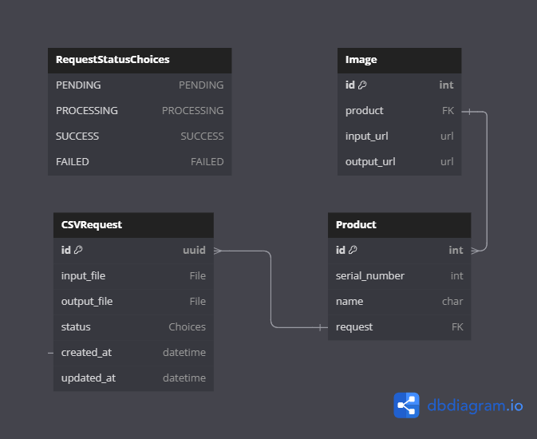
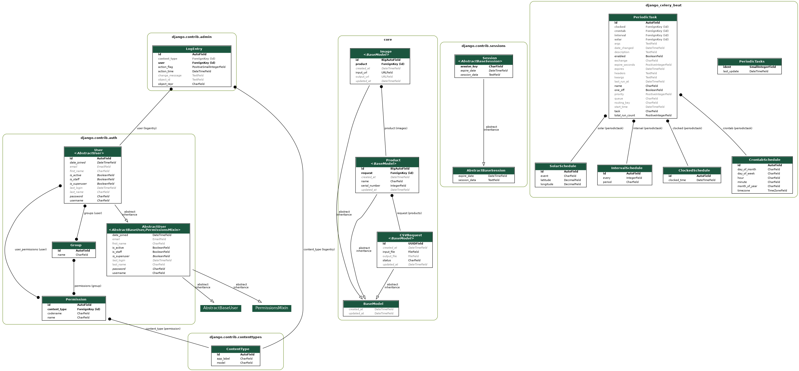

# Database Schema Overview

## Scehma Overview

This image provides a comprehensive view of the database schema, showing multiple interconnected tables and their relationships.

## Detailed Schema (with built-ins)

This image shows a more detailed view of specific tables related to request processing and product management.

## Table Descriptions

### BaseModel
- Abstract Model serving as the common for all models/tables in the system.
- **created_at**: Timestamp for creation
- **updated_at**: Timestamp for last update

### RequestStatusChoices
- **choices** - Enum to mark the status of a Request (PENDING, PROCESSING, SUCCESS, FAILED)

### CSVRequest

- **id**: UUID primary key
- **input_file**: File field for input CSV
- **output_file**: File field for output CSV
- **status**: Choice field (RequestStatusChoices)

### Image

- **id**: Integer primary key
- **product**: Foreign key to Product
- **input_url**: URL field for input image
- **output_url**: URL field for output image

### Product

- **id**: Integer primary key
- **serial_number**: Integer field
- **name**: Character field
- **request**: Foreign key to CSVRequest

## Relationships

- Products are associated with CSVRequests and Images, showing a connection between product data, CSV processing, and image handling.
- The various scheduling models (IntervalSchedule, CrontabSchedule, etc.) are used by PeriodicTask to define recurring tasks.

## Notes

- The schema uses a mix of integer and UUID primary keys.
- The document only discusses the custom application models, not the Django's built-in models (auth, admin, sessions).
- The diagrams were generated using **[dbdiagram.io](https://dbdiagram.io/)** and **`pygraphviz`** library.