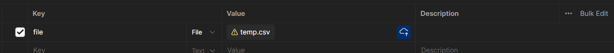

# API Documentation

The overview of the API Endpoints and their behaviour is discussed in the [LLD API Endpoint](LLD.md#21-api-endpoints) section.

Checkout the [Postman Collection](https://www.postman.com/technical-cosmonaut-46398121/workspace/image-data-processing/collection/33383480-2dc07c96-a6d9-40f8-baeb-8ebe2c8252c3?action=share&creator=33383480) for the endpoints.

### 1. Upload CSV Endpoint
- **Curl**:
```bash
curl --location 'localhost:8000/api/upload/' \
--form 'file=@"{{FILE_LOCATION}}"'
```
- **Sample Request**:



- **Sample Response**:
```json
{
    "status": "success",
    "message": "File uploaded successfully",
    "payload": {
        "request_id": "e6a4edab-3456-4781-bb8d-b3919c873365"
    }
}
```

### 2. Request Output/Status Endpoint
- **Curl**:
```bash
curl --location 'localhost:8000/api/output/?request_id={{REQUEST_ID}}'
```
- **Sample Response**:
```json
{
    "status": "success",
    "message": "",
    "payload": {
        "status": "SUCCESS",
        "output_file_url": "http://localhost:8000/media/csv_files/output/temp_SFdiZAs.csv_output.csv"
    }
}
```