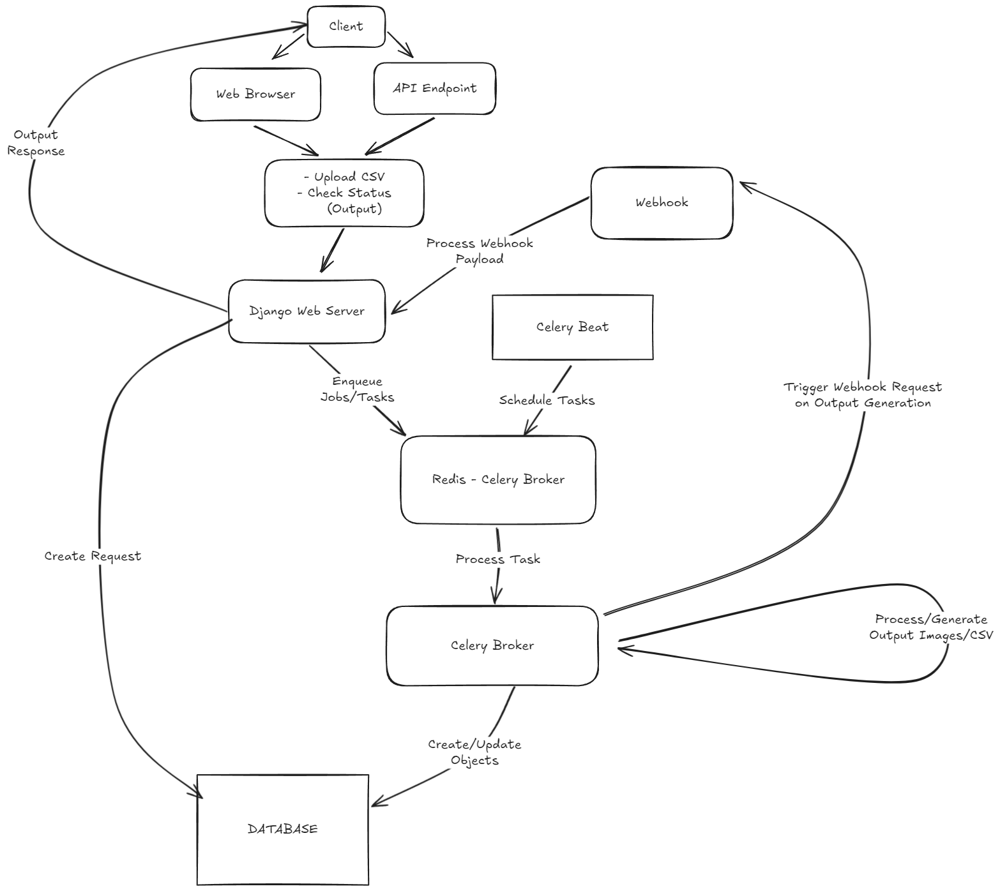

# Low Level Design Document: Image Data Processing

## 1. System Overview
This system is designed to process CSV files containing product information and image URLs. It compresses the images asynchronously and generates a new CSV with updated image URLs.



## 2. System Components

### 2.1 API Endpoints
#### Upload API
- **Role**: Accepts CSV file uploads and creates a request.
- **Function**: 
    - Validates incoming CSV files.
    - Creates a new `CSVRequest` object in the database in `PENDING` state.
    - Returns a unique request ID to the client.
- **Endpoint**: `POST /api/upload/`
- **Input**: CSV file
- **Output**: Request ID (UUID)
    - **Sample Response**:
        ```json
            {
                "status": "success",
                "message": "File uploaded successfully",
                "payload": {
                    "request_id": "e6a4edab-3456-4781-bb8d-b3919c873365"
                }
            }
        ```

#### Output API
- **Role**: Provides the current status of a processing request along with the output CSV url if created.
- **Function**: 
    - Accepts a request ID.
    - Queries the database for the current status of the request.
    - Returns the status and, if completed, the URL of the processed CSV.
- **Endpoint**: `GET /api/output/`
- **Input**: Request ID (as query parameter)
- **Output**: Request status and output file URL (if available)
    - **Sample Response**:
        ```json
            {
                "status": "success",
                "message": "",
                "payload": {
                    "status": "SUCCESS",
                    "output_file_url": "http://example_output.com"
                }
            }
        ```


### 2.2 Services
#### CSV Upload Service
- **Role**: Uploads a CSV to the DB.
- **Function**:
    - Creats a `CSVRequest` object with the file uploaded in request.
    - The object is created in `PENDING` status.
    - Returns the created `CSVRequest` object.
- **Implementation**: Service Class `CSVUploadService`

#### Request Processing Service
- **Role**: Processes `CSVRequest` asynchronously.
- **Function**:
    - Reads input CSV files from the request using `pandas`.
    - Processes images from the CSV.
        - Downloads images from provided URLs.
        - Compresses images by 50%.
        - Saves processed images.
    - Generates output CSV with updated image URLs.
    - Updates request `status` and `output` in the database.
    - Triggers webhook callback upon completion.
- **Implementation**:
    - Celery task (`process_pending_requests`)
    - Service Class (`CSVProcessService`)

#### Request Output Service
- **Role**: Fetches the `CSVRequest` object from the DB.
- **Function**:
    - Queries the Database for `CSVRequest` object corresponding to the `request_id`.
    - Returns the object if found.
    - Raises `CSVRequestNotFoundException` if object is not found.
    - Raises `Exception` in case of any other error.
- **Implementation**: Service Class (`CSVOutputService`)

### 2.3 Webhook Handler

#### Webhook Service
- **Role**: Sends a request for webhook callback.
- **Function**:
    - Sends a `POST` request to the webhook endpoint.
    - Sends the request data in the request `payload`.
    - Triggered from the task upon generation of output csv successfully.
- **Implementation**: Service Class (`WebhookService`)

#### Webhook Process Endpoint
- **Role**: Processes callbacks from the image processing service.
- **Function**:
    - Receives POST requests from the image processing service.
    - Logs/Prints the payload of the recieved request.
    - Triggers any necessary notifications or follow-up actions.
- **Endpoint**: `POST /api/webhook/`

### 2.4 Celery Queue
- **Role**: Manages asynchronous task execution.
- **Function**:
  - Enqueues image processing jobs.
  - Executes jobs based on available workers and priorities.
  - Handles task retries and failure scenarios.
  - Using `celery-beat` for periodic/cron tasks.
- **Configuration**:
  - Broker: Redis
  - Result Backend: Redis
  - Periodic tasks:
    - Process pending requests: Every 1 minute (To be changed according to relevant usecase)
        - Picks and processes CSV Requests in `PENDING` state.
    - Reconcile failed requests: Every 10 minutes (To be changed according to relevant usecase)
        - Picks and processes CSV Requests in `FAILED` state.

## 3. Data Flow

1. Client uploads a CSV file via the Upload API.
2. Upload API validates the file and creates a `CSVRequest` object.
3. A processing job is enqueued in the Celery queue through the periodic tasks running int the background - `reconcile_failed_requests` and `process_pending_requests`.
4. The Image Processing Service (Celery worker) picks up the job.
5. Images are processed, and an output CSV is generated.
6. The database is updated with the new status and output file.
7. A webhook callback is triggered to notify of completion which logs the payload.
8. The client can check the status using the Status/Output API at any time.

## 4. Error Handling
- Implement comprehensive error handling for each component.
- Implement custom exceptions for specific error scenarios (e.g., `CSVRequestNotFoundException`).
- Using print statements to Log the errors.
- **TODO**: replace print statements with Django's Logging system for info, errors and warnings.
