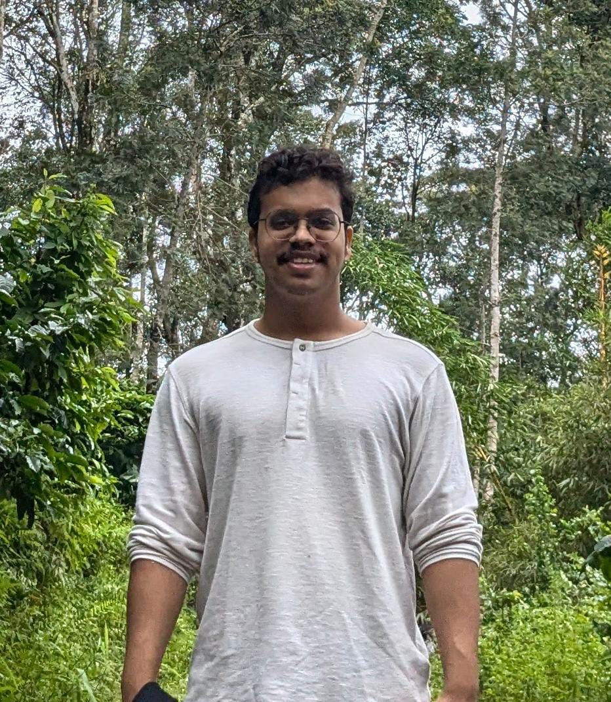

# Image Data Processing
This system is designed to process CSV files containing product information and image URLs.
It compresses the images asynchronously and generates a new CSV with updated image URLs.

## Database Schema
The System includes segregated components for a robust architechture.

Please checkout the in depth schema and overview of the system - [Database Schema Document](/Docs/Database.md).

## Low Level Design
The System includes multiple components like:
- Database (DB),
- Endpoints,
- Background Tasks and workers, etc.

Please checkout the complete LLD and overview of the system - [LLD Document](/Docs/LLD.md).

## API Endpoints
The Endpoints role and functions are discussed int the LLD Document's [API Endpoint Section](/Docs/LLD.md#21-api-endpoints).

Please see for the behaviour with sample requests, response, curl and **Postman** Collection - [API Endpoints](/Docs/Endpoints.md).

## Development Practices
- Used sqlite3 for initial development and can be shifted to PostgresQL during production.
- Used `APIView` from the `rest_framework` views for convinient logic.
- Used a service layer (`servies.py`) for any interactions and logic segregation from views.
- Used `redis` as broker and result-backend for `celery` to implement background/async processing.

## About Me

  

I'm Ayush, a 2024 graduate with a Bachelor's in Computer Science and Engineering.

**About me**:
I'm currently working as a Backend Developer. I have strong problem solving skills and regularly practice on major coding platforms like Leetcode, Codeforces.

**Hackathon Wins**:

1. Kavach 2023 - Created a tool for cryptocurrency transaction investigations to filter shady transactions and their block ends (wallet addresses of the users).

2. Smart India Hackathon 2022 - Created a Health and Fitness application with features like live exercise tracking and detection, information through web scrapping, community forums, user profiles, etc.

**Projects and Other Contributions**:

Some of my notable projects and contributions include
- Cryptocurrency Tracker Application
    - Sends alerts to a user via email when a trade reaches the set price.
    - https://github.com/Jain-Ayush-11/CryptoCurrency-Price-Tracker
- FitMantra
    - Hackathon winning project
    - Application to boost and assist in keeping Fit.
    - https://github.com/GeekGawd/Fit-Mantra-Backend
- I was also part of my college's R&D department, contributing to developing projects like the Late Entry System for the college and a Smart Attendance System for the department lab.
- I'm also rated 1791 on Leetcode and 1330 on Codeforces.

## Resources Used
- [Celery Documentation for Django](https://docs.celeryq.dev/en/stable/django/first-steps-with-django.html#using-celery-with-django)
- [Django Rest Framework Documentation](https://www.django-rest-framework.org/)
- [Stackoverflow](https://stackoverflow.com/)
